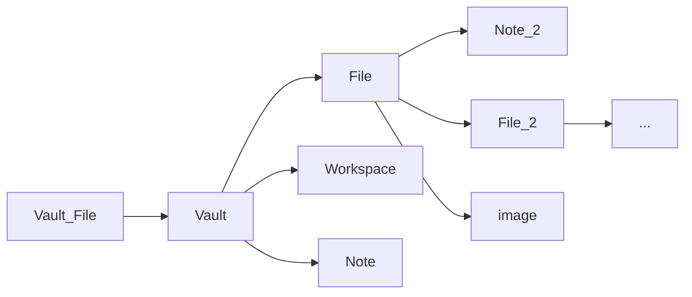

### Heirarchy terms
Vault: The space where all notes, files, images, workspace, etc are stored. I have sent you a zipped vault, the vault folder is named `Quick Guide Vault`
Note: you are currently in a note, it's where the magic happens.
File: File
Workspace: the workspace is the word that denotes all of the settings, plugins, schemes you have setup. Workspaces will be different across vaults, you can export workspaces in the settings to transfer them to different vaults. Some plugins will affect notes/ files/ content so be warned.

Heirarchy looks a little something like this:


You can make flowcharts and other [diagrams](https://help.obsidian.md/How+to/Format+your+notes#Diagram like this using [Mermaid](https://mermaid.js.org/intro/) using [mermaid](https://mermaid.js.org/intro/) inside of codeblocks, super neat stuff.

Play around with settings until you find whats comfortable, you can't break too much. When in doubt check the [Documentation](https://help.obsidian.md/How+to/Format+your+notes) or ask questions.

## <u> Text formatting </u>

Horizontal rule:

---
Horizontal rules will force the line above it (line 11 in this case) to become a header and break display on itself, example:

Horizontal rule
---

*ital*
_also ital_
**bold**
***bold ital***
~~strike~~

as always use backslash to escape formatting, otherwise
- using a hyphen on the start of a line does this
\- and not this

==Highlight==
> quotes, require a page break after to break formatting
> otherwise they do this

note, quotes, highlights, checklists, and other special text interactions will follow your color scheme :)

Math can be done using $ characters, Obsidian uses MathJax, which uses LaTeX so for your own sanity just search "latex math symbols" or something if you are looking for something not in the quick reference for maths.

quick example: $$e^{i*\pi}+1 = 0$$
Otherwise see [[Math notation refs]]

- bullet
1) number
- [ ] checklist
- [x] checklist

Table | A | B
---- | ----| ----
C | D | E

\*In tables, the top row cells will always be bolded for readability

	Indent (hotkey: Ctrl + ])

`inline code block`

```
Code block
```

```java
Specific language block (change java to whatever language you desire)
```

## <u> HTML text formatting  </u>
(pls learn HTML, it's very nice)

---
<center> centered with HTML tags </center>
<span style="color:#ffbb00;"> colored text, uses hex colors :D </span>
<u> underline text </u>

## <u> Internal links (URIs)</u>

---
^dummy-link

Internal links can be made quickly by using the `[[wikilink]]` format.
Links to this document wont do anything as you are in the document already, but block links, header links, and links with other parameters will pull you to that anchor on the page, useful later.

Inline: [[Markdown quick refs]]

Link with no text:
[[Markdown quick refs]]
Links to a whole page

Link with text:
[[Markdown quick refs|Im a link!]]
This also links to a whole page, but has specific text.

Link to specific block:
[[Markdown quick refs#^dummy-link]]
To link to a block assign a block ID using a karat, block ID's can contain 0-1, a-z, and dashes, block links will highlight the linked block, a block is all lines of text that contain characters and are touching.

Link to a header:
[[Markdown quick refs#<u> Internal links</u>]]
If you want to link to multiple lines that are separated, link to their header, as header links will highlight all text up until the next header.

Link to a header with text:
[[Markdown quick refs#<u> Internal links</u>|Beam me up]]

Pasting in an image will give it a random name and put it physically into your obsidian file directory as a .png file, this can go into a storage file in obsidian for cleaner file organization.

Internal images can be displayed by linking to them normally, then putting and exclamation in front of them which looks like this:
`![[Pasted image 20230113143037.png]]`

and acts like this:
![[Borzoi Snoz.png]]

You can also change the size of images, it will scale according to the aspect ratio:
![[Borzoi Snoz.png|100]]

## <u> External links (URLs) </u>

---

URL/ URI general rule, linking to something that has spaces, replace the space with `%20`
so `Markdown Quick Refs` becomes `Markdown%20Quick%20Refs` when using URL/URI format to link to them. This is important later when linking to external documents. You can also enclose a target with <>, but it's not necessary. It's a powerful tool that lets you dynamically link around to different places in obsidian without having to go and do some magic bull-shittery. 

URI's are a little weird so I'll just link to their documentation:
https://help.obsidian.md/Advanced+topics/Using+obsidian+URI

URI style link:
(This link just links to this page, it wont do anything, but it's an important concept for later)
[Markdown quick refs](Markdown%20quick%20refs.md)

Links are usually automatic and can just be pasted:
https://help.obsidian.md/How+to/Format+your+notes

And can be obscured like so:
[Format your notes](https://help.obsidian.md/How+to/Format+your+notes)

Inline links work [fine too](https://help.obsidian.md/How+to/Format+your+notes)

## <u> Embedding content </u>

---

==important==: Dragging and dropping something into this window will bring it into obsidian, dragging and dropping, images, sound files, videos, other embedable files will cause it to appear in the side bar, which then it can be linked too/ embedded.

Obsidian comes with an audio recorder (off by default)
`Settings > Core plugins > Audio Recorder` and will save the audio into the obsidian vault for later referencing.

Accepted file types for embedding:
1.  Markdown files: `md`
2.  Image files: `png`, `jpg`, `jpeg`, `gif`, `bmp`, `svg`
3.  Audio files: `mp3`, `webm`, `wav`, `m4a`, `ogg`, `3gp`, `flac`
4.  Video files: `mp4`, `webm`, `ogv`, `mov`, `mkv`
5.  PDF files: `pdf`

Embedded PDF:

![[Example.pdf]]

## Embedding a webpage/ youtube:

Embedding webpages requires iframes from HTML, but you can basically use the following as a template.

Youtube makes it much easier as they have an embed code generator on all of their videos, clicking the share button, then embed option gives you the HTML to paste automagically and it works every time! (some videos are not allowed to play embedded, and will say `watch on youtube` or something like that)

<iframe width="560" height="315" src="https://www.youtube.com/watch?v=dQw4w9WgXcQ" title="YouTube video player" frameborder="0" allow="accelerometer; autoplay; clipboard-write; encrypted-media; gyroscope; picture-in-picture; web-share" allowfullscreen></iframe>

For other webpages, it's the same idea:

<iframe width="560" height="315" src="https://en.wikipedia.org/wiki/Java_(programming_language)"></iframe>
